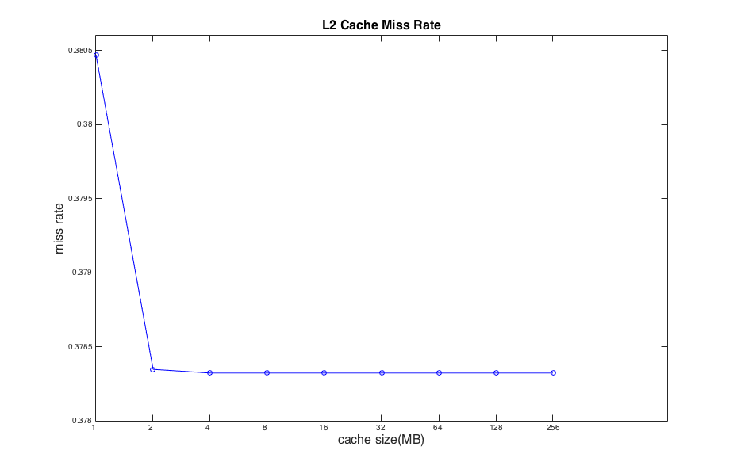
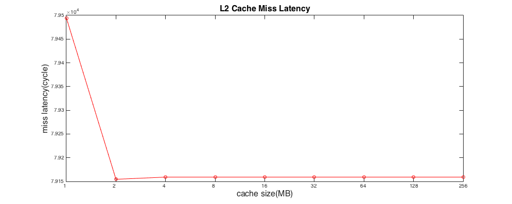
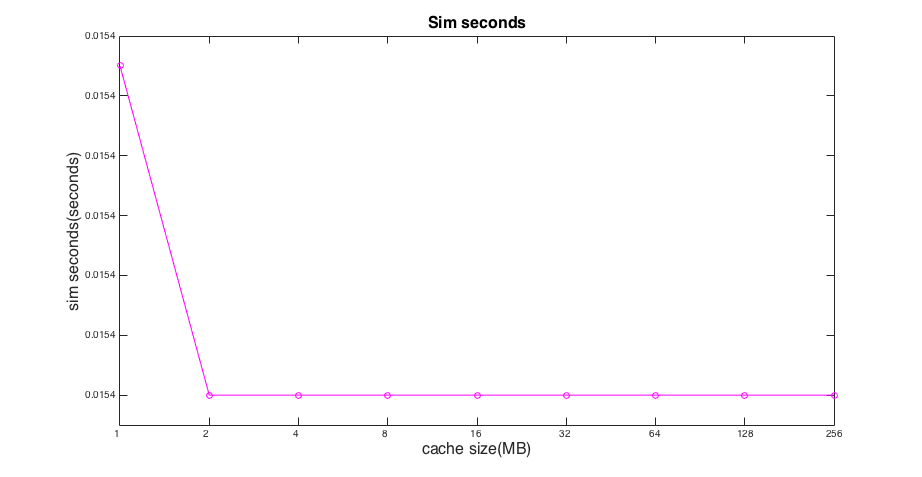

# 
 Advanced Computer Architecture 

### 
 [HW2] 102062111 林致民 

## PART II

### Study the effect of the size of L2 Cache

這裡我選了一些L2 cache szie，分別是 [1 2 4 8 16 32 64 128 256]，這些size都是2的次方數

* **L2 Cache Miss Rate**  其實可以發現到，L2 Cache miss rate 在 2MB ~ 4MB 有些微的減少，但是在8MB之後，都沒有減少cache miss rate 的跡象。

* **L2 Cache average miss latency**  變化最劇烈的部分在 1MB 的L2 Cache Size --> 2MB 的L2 Cache Size，增加L2 cache 的確可以減少miss latency。但是從2MB增加到4MB，latency 反而會上升，之後就沒變化，

* **Sim seconds**  這個實驗有趣的地方在於sim seconds 除了從1 MB的 L2 cahce增加到2MB的 L2 cache 會見少以外，其他的sim seconds 都是一樣的數值，L2 cache 持續增大依舊不能減少sim_seconds。

### Calculate the average memory access time ofr L1 Cache

從(a)跑出來的數據中，抓出L1 cacache(d_cache & i_cache)的miss rate和total access，目的是要計算L1 cache的average miss rate，L1 cache average miss rate 的計算方式如下：
	
### 
 $L1\ cache\ average\ miss\ rate = \frac{d\_access \times d\_miss\_rate + i\_access \times i\_miss\_rate}{d\_access+i\_access}$ 

|L2 cache(MB)|d_access|d_miss_rate|i_access|i_miss_rate|L1_miss_rate|AMAT|
|:----------:|:------:|:---------:|:------:|:---------:|:----------:|:----:|
|1 | 2665101.0 | 0.005937 | 11248307.0 | 0.002112| 0.00284468 | 1.1907933725607434 |
|2 | 2665101.0 | 0.005937 | 11248307.0 | 0.002112| 0.00284468 | 1.189887912391144 |
|4 | 2665101.0 | 0.005937 | 11248307.0 | 0.002112| 0.00284468 | 1.1898772448585144 |
|8 | 2665101.0 | 0.005937 | 11248307.0 | 0.002112| 0.00284468 | 1.1898772448585144 |
|16 | 2665101.0 | 0.005937 | 11248307.0 | 0.002112| 0.00284468 | 1.1898772448585144 |
|32 | 2665101.0 | 0.005937 | 11248307.0 | 0.002112| 0.00284468 | 1.1898772448585144 |
|64 | 2665101.0 | 0.005937 | 11248307.0 | 0.002112| 0.00284468 | 1.1898772448585144 |
|128 | 2665101.0 | 0.005937 | 11248307.0 | 0.002112| 0.00284468 | 1.1898772448585144 |
|256 | 2665101.0 | 0.005937 | 11248307.0 | 0.002112| 0.00284468 | 1.1898772448585144 |
|512 | 2665101.0 | 0.005937 | 11248307.0 | 0.002112| 0.00284468 | 1.1898772448585144 |
|1024 | 2665101.0 | 0.005937 | 11248307.0 | 0.002112| 0.00284468 | 1.1898772448585144 |
