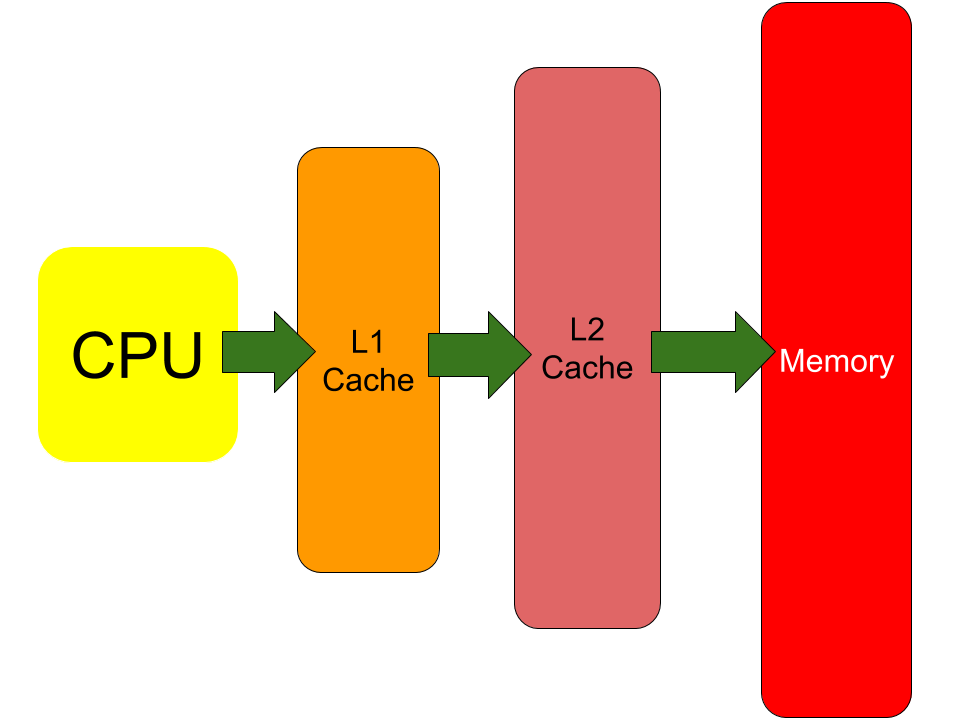

# 
 Advanced Computer Architecture 

### 
 [HW2] 102062111 林致民 

## PART I

***以下是此題目的Memory簡易架構圖，並以block簡稱cache block***

  

### (a)

#### **題目規定：**

1. 由於題目給定需要使用write through，而且他有2 Level的Cache。
2. 當發生cache miss的時候，要先把一個block抓進cache裡面。
3. 一開始都是沒有把block 抓進cache的狀態。
4. 一個block有32 bytes

#### 直接從CPU Write data 到 memory 需要經過三個階段： 

1. 發生cache miss，一個block從memory --> L2 cache --> L1 cache，中間經過 ***2次*** 的傳輸。
2. CPU --> L1 Cache：CPU把4 bytes的資料寫到L1 Cache中
3. L1 --> L2 --> Memory，這圖中做了兩次 data trasferring，每一次transfer都會消耗時間，所以這個階段經過 ***2次*** Transfer。

從cache miss到把data寫回memory總共做了 ***「2 + 2 = 4次一個block size」 和 「1次4 bytes」*** 的transfer。
計算方法題目給定，我們write data 到 memory 會是以block(32 bytes)為單位：

##### 
 $Total\ transfering\ cycles\\ \ \ = 4\ transferr \times \left( 10 + 5 \times \left( \lceil \frac{block\ size}{8} \rceil - 1 \right) \right) + 1 \times (10 + 5 \times (\lceil \frac{4}{8} \rceil - 1)) \\ \ \ = 4 \times (10 + 5 \times ( \lceil \frac{32}{8} \rceil - 1 ) ) + 10\\ \ \ = 4 \times 25 + 10 = 110\ cycles$ 

### (b)

#### 題目規定

1. 由於題目給定需要使用write back，而且他有2 Level的Cache。
2. 當發生cache miss的時候，要先把一個block抓進cache裡面。
3. 一開始都是沒有把block 抓進cache的狀態。
4. 一個block有32bytes

#### Write back 經過的步驟：

1. 發生cache miss，一個block從memory --> L2 cache --> L1 cache，中間經過 ***2次*** 的傳輸。
2. CPU --> L1 Cache：CPU把4 bytes的資料寫到L1 Cache中

由於Write back不用隨時把一整個block寫回memory，所以把資料寫進memory只要寫進L1 Cache，之後如果塞滿，或者是這個block被換掉的時候，再把這個block寫回memory，所以總共做了 ***「2次一個block size」和「1次4 bytes」*** 傳輸，那麼總傳輸時間：
##### 
 $Total\ transfering\ cycles\\ \ \ = 2\ transferr \times \left( 10 + 5 \times \left( \lceil \frac{block\ size}{8} \rceil - 1 \right) \right) + 1 \times (10 + 5 \times (\lceil \frac{4}{8} \rceil - 1)) \\ \ \ = 2 \times (10 + 5 \times ( \lceil \frac{32}{8} \rceil - 1 ) ) + 10\\ \ \ = 2 \times 25 + 10 = 60\ cycles$ 

### (c)

#### 題目規定
1. PORTION = 8，分別計算Write through & Write back 的transfer cycle。
2. 當發生cache miss的時候，要先把一個block抓進cache裡面。
3. 一開始都是沒有把block 抓進cache的狀態。
4. 一個block有32bytes

#### Write through
1. 一開始發生cache miss，一個block從memory --> L2 cache --> L1 cache，中間經過 ***2次*** 的傳輸
2. CPU --> L1 Cache：CPU把4 bytes的資料寫到L1 Cache中，j = 0 ~ 7 做了 **8次**
3. L1 --> L2 --> Memory，這圖中做了兩次 data trasferring，每一次transfer都會消耗時間，所以這個階段經過 ***2次*** Transfer。j = 0 ~ 7 做了 ***8次***，總共 **8 x 2 = 16次**
4. block傳輸總共有 **16 + 2 =  18次**，4 bytes **資料傳輸有 8次**

##### 
 $Total\ transfering\ cycles\\ \ \ = 18\ transferr \times \left( 10 + 5 \times \left( \lceil \frac{block\ size}{8} \rceil - 1 \right) \right) + 8\ transfer \times (10 + 5 \times (\lceil \frac{4}{8} \rceil - 1)) \\ \ \ = 18 \times (10 + 5 \times ( \lceil \frac{32}{8} \rceil - 1 ) ) + 80\\ \ \ = 18 \times 25 + 80 = 530\ cycles$ 

#### Write Back
1. **由於一個block有32 bytes，而一個array d[ ] 的entry有4 bytes，代表最多可以塞 32 / 4 = 8 個entry才把一個block換掉，因此j = 0 ~ 7只會一開始把資料從memory 抓進cache，以及 j = 7 的時候把資料寫回memory**
2. 一開始發生cache miss，一個block從memory --> L2 cache --> L1 cache，中間經過 ***2次*** 的傳輸
3. CPU --> L1 Cache：CPU把4 bytes的資料寫到L1 Cache中，這裡做了 **8次**
4. L1 --> L2 --> Memory，這圖中做了兩次 data trasferring，每一次transfer都會消耗時間，所以這個階段經過 ***2次*** Transfer。**只在 j = 7 的時候，把data寫回memory**。
5. block傳輸總共有 **2 + 2 = 4 次**，**4 bytes 傳輸有 8次**

##### 
 $Total\ transfering\ cycles\\ \ \ = 4\ transferr \times \left( 10 + 5 \times \left( \lceil \frac{block\ size}{8} \rceil - 1 \right) \right) + 8\ transfer \times (10 + 5 \times (\lceil \frac{4}{8} \rceil - 1)) \\ \ \ = 4 \times (10 + 5 \times ( \lceil \frac{32}{8} \rceil - 1 ) ) + 80\\ \ \ = 4 \times 25 + 80 = 180\ cycles$ 

### (d)

由於一個block有32 bytes，而一個array d[ ] 的entry有4 bytes，代表最多可以塞 32 / 4 = 8 個entry才把一個block換掉。因此***當array length = 8 的時候，是把一個cache block換掉的最小長度。***

## PART II

*(以下的實驗都是採用gcc作為benchmark)*

### (a) Study the effect of the size of L2 Cache

這裡我選了一些L2 cache szie，分別是 [1 2 4 8 16 32 64 128 256]，這些size都是2的次方數

* **L2 Cache Miss Rate** 

	 
	
	其實可以發現到，L2 Cache miss rate 在 2MB ~ 4MB 有些微的減少，但是在8MB之後，都沒有減少cache miss rate 的跡象。

* **L2 Cache average miss latency** 

	
	
	 變化最劇烈的部分在 1MB 的L2 Cache Size --> 2MB 的L2 Cache Size，增加L2 cache 的確可以減少miss latency。但是從2MB增加到4MB，latency 反而會上升，之後就沒變化，

* **Sim seconds** 

	 
	
	這個實驗有趣的地方在於sim seconds 除了從1 MB的 L2 cahce增加到2MB的 L2 cache 會見少以外，其他的sim seconds 都是一樣的數值，L2 cache 持續增大依舊不能減少sim_seconds。

### (b) Calculate the average memory access time ofr L1 Cache

從(a)跑出來的數據中，抓出L1 cacache(d\_cache & i_cache)的miss rate和total access，目的是要計算L1 cache的average miss rate，L1 cache average miss rate 的計算方式如下：
	
### 
 $L1\ cache\ average\ miss\ rate = \frac{d\_access \times d\_miss\_rate + i\_access \times i\_miss\_rate}{d\_access+i\_access}$ 

再來就是L1 cache 的 Average memory access time(以下簡稱**AMAT**)，**AMAT**的計算方式如下：

##### 
 $AMAT = hit + miss\ rate\ \times\ miss\ penalty$ 

當L1 cache miss的時候，這時候情況會分為兩種：(a) L2 cache hit  (b) L2 cache miss。所以L1 cache的***miss penalty***取決於L2 cache 的**AMAT**，所以修正L1 Cache AMAT的計算方式：

##### 
 $L2\_AMAT = L2\ hit + L2\ miss\ rate \times L2\ miss\ penalty$ 

##### 
 $L1\_AMAT = L1\ hit + L1\ miss\ rate \times L2\ AMAT$ 

**以下是所有跑出來的數據：**

|L2 cache(MB)|d_access|d\_miss_rate|i_access|i\_miss_rate|L1\_miss_rate| L1 AMAT|
|:----------:|:------:|:---------:|:------:|:---------:|:----------:|:----:|
|1 | 2665101.0 | 0.005937 | 11248307.0 | 0.002112| 0.00284468 | 1.1907933725607434 |
|2 | 2665101.0 | 0.005937 | 11248307.0 | 0.002112| 0.00284468 | 1.189887912391144 |
|4 | 2665101.0 | 0.005937 | 11248307.0 | 0.002112| 0.00284468 | 1.1898772448585144 |
|8 | 2665101.0 | 0.005937 | 11248307.0 | 0.002112| 0.00284468 | 1.1898772448585144 |
|16 | 2665101.0 | 0.005937 | 11248307.0 | 0.002112| 0.00284468 | 1.1898772448585144 |
|32 | 2665101.0 | 0.005937 | 11248307.0 | 0.002112| 0.00284468 | 1.1898772448585144 |
|64 | 2665101.0 | 0.005937 | 11248307.0 | 0.002112| 0.00284468 | 1.1898772448585144 |
|128 | 2665101.0 | 0.005937 | 11248307.0 | 0.002112| 0.00284468 | 1.1898772448585144 |
|256 | 2665101.0 | 0.005937 | 11248307.0 | 0.002112| 0.00284468 | 1.1898772448585144 |
|512 | 2665101.0 | 0.005937 | 11248307.0 | 0.002112| 0.00284468 | 1.1898772448585144 |
|1024 | 2665101.0 | 0.005937 | 11248307.0 | 0.002112| 0.00284468 | 1.1898772448585144 |

在 L2 Cache 從 1MB 增加到 4MB，L1 Cache 的 AMAT 會變少，之後還是一樣維持不變，不過造成這個現象的原因是，L1 cache 的miss rate ***並沒有因為 L2 cache size 而改變***，反倒是因為L2 Cache miss rate 改變才會造成 L1 AMAT 的數據變化。 

### (c) Study the effects of the associativity of L2 cache. 

首先我選擇四種不同的cache size : 1MB, 2MB, 4MB, 8MB 和四種不同的L2 Set associative：1, 2, 4, 8。這個實驗室要觀察不同 cache size 和不同set assiciative 之間有什麼關係。***（以下的圖表折線分別表示不同的cache size：藍色1MB、紅色2MB、粉紅色4MB，黑色8MB)***

* **Miss rate** 

	 
	
	1 MB cache size 增加set的個數，會大幅降低miss rate，而8MB的miss rate，miss rate 基本上完全沒有變化。可以從圖表推論，當我的L2 cache size 越大的時候，set個數增加能夠降低miss rate的幅度越小。

* **Miss latency** 

	 
	
	1MB 和 2MB 的cache 有個共同現象是，從1個set 增加變成2個set，miss latency會下降，但是在之後增加set個數就不一定了。4MB的cache 從1 set增加到2 set，其miss latency反而會上升。16MB的倒是完全沒有變化。

* **Sim Seconds** 

	 
	
	雖然整體而言，增加Set會減少sim seconds，進而增進效能，但是set個數增加到某個程度，其實會發現sim seconds 無法再降下去，從這三個結果推論，set個數也不是越多越好，增高越多set所花費的成本越高，但換來的效益卻沒這麼多。此外，影響最劇烈的應該是較小的L2 cache size，大的L2 cache size對於增加set個數獲得的效益較小。

### (d) Repeat (b) for L2 caches with different associativity

使用的計算方法跟**(b)**一樣，以下我選擇不同L2 Cache Size＆Set的實驗表格＆數據：

**L2 Cache 1MB**

|set         |d_access|d miss rate|i_access|i miss rate|L1 miss rate|L2 miss rate|AMAT|
|:----------:|:------:|:---------:|:------:|:---------:|:----------:|:----------:|:----:|
|1 | 2665101.0 | 0.005937 | 11248307.0 | 0.002112| 0.00284468 | 0.395499 | 1.1972066931776508 |
|2 | 2665101.0 | 0.005937 | 11248307.0 | 0.002112| 0.00284468 | 0.383399 | 1.192043607384931 |
|4 | 2665101.0 | 0.005937 | 11248307.0 | 0.002112| 0.00284468 | 0.381126 | 1.191073715318249 |
|8 | 2665101.0 | 0.005937 | 11248307.0 | 0.002112| 0.00284468 | 0.380469 | 1.1907933725607434 |
|16 | 2665101.0 | 0.005937 | 11248307.0 | 0.002112| 0.00284468 | 0.378953 | 1.1901464933820853 |
|32 | 2665101.0 | 0.005937 | 11248307.0 | 0.002112| 0.00284468 | 0.378751 | 1.1900602997184382 |
|64 | 2665101.0 | 0.005937 | 11248307.0 | 0.002112| 0.00284468 | 0.378473 | 1.1899416767555973 |
|128 | 2665101.0 | 0.005937 | 11248307.0 | 0.002112| 0.00284468 | 0.378322 | 1.1898772448585144 |
**L2 Cache 2MB**

|set         |d_access|d miss rate|i_access|i miss rate|L1 miss rate|L2 miss rate|AMAT|
|:----------:|:------:|:---------:|:------:|:---------:|:----------:|:----------:|:----:|
|1 | 2665101.0 | 0.005937 | 11248307.0 | 0.002112| 0.00284468 | 0.388224 | 1.194102441182441 |
|2 | 2665101.0 | 0.005937 | 11248307.0 | 0.002112| 0.00284468 | 0.378701 | 1.190038964653179 |
|4 | 2665101.0 | 0.005937 | 11248307.0 | 0.002112| 0.00284468 | 0.378423 | 1.1899203416903381 |
|8 | 2665101.0 | 0.005937 | 11248307.0 | 0.002112| 0.00284468 | 0.378347 | 1.189887912391144 |
|16 | 2665101.0 | 0.005937 | 11248307.0 | 0.002112| 0.00284468 | 0.378322 | 1.1898772448585144 |
|32 | 2665101.0 | 0.005937 | 11248307.0 | 0.002112| 0.00284468 | 0.378322 | 1.1898772448585144 |
|64 | 2665101.0 | 0.005937 | 11248307.0 | 0.002112| 0.00284468 | 0.378322 | 1.1898772448585144 |
|128 | 2665101.0 | 0.005937 | 11248307.0 | 0.002112| 0.00284468 | 0.378322 | 1.1898772448585144 |
**L2 Cache 4MB**

|set         |d_access|d miss rate|i_access|i miss rate|L1 miss rate|L2 miss rate|AMAT|
|:----------:|:------:|:---------:|:------:|:---------:|:----------:|:----------:|:----:|
|1 | 2665101.0 | 0.005937 | 11248307.0 | 0.002112| 0.00284468 | 0.379105 | 1.1902113519804731 |
|2 | 2665101.0 | 0.005937 | 11248307.0 | 0.002112| 0.00284468 | 0.378322 | 1.1898772448585144 |
|4 | 2665101.0 | 0.005937 | 11248307.0 | 0.002112| 0.00284468 | 0.378322 | 1.1898772448585144 |
|8 | 2665101.0 | 0.005937 | 11248307.0 | 0.002112| 0.00284468 | 0.378322 | 1.1898772448585144 |
|16 | 2665101.0 | 0.005937 | 11248307.0 | 0.002112| 0.00284468 | 0.378322 | 1.1898772448585144 |
|32 | 2665101.0 | 0.005937 | 11248307.0 | 0.002112| 0.00284468 | 0.378322 | 1.1898772448585144 |
|64 | 2665101.0 | 0.005937 | 11248307.0 | 0.002112| 0.00284468 | 0.378322 | 1.1898772448585144 |
|128 | 2665101.0 | 0.005937 | 11248307.0 | 0.002112| 0.00284468 | 0.378322 | 1.1898772448585144 |
**L2 Cache 8MB**

|set         |d_access|d miss rate|i_access|i miss rate|L1 miss rate|L2 miss rate|AMAT|
|:----------:|:------:|:---------:|:------:|:---------:|:----------:|:----------:|:----:|
|1 | 2665101.0 | 0.005937 | 11248307.0 | 0.002112| 0.00284468 | 0.378322 | 1.1898772448585144 |
|2 | 2665101.0 | 0.005937 | 11248307.0 | 0.002112| 0.00284468 | 0.378322 | 1.1898772448585144 |
|4 | 2665101.0 | 0.005937 | 11248307.0 | 0.002112| 0.00284468 | 0.378322 | 1.1898772448585144 |
|8 | 2665101.0 | 0.005937 | 11248307.0 | 0.002112| 0.00284468 | 0.378322 | 1.1898772448585144 |
|16 | 2665101.0 | 0.005937 | 11248307.0 | 0.002112| 0.00284468 | 0.378322 | 1.1898772448585144 |
|32 | 2665101.0 | 0.005937 | 11248307.0 | 0.002112| 0.00284468 | 0.378322 | 1.1898772448585144 |
|64 | 2665101.0 | 0.005937 | 11248307.0 | 0.002112| 0.00284468 | 0.378322 | 1.1898772448585144 |
|128 | 2665101.0 | 0.005937 | 11248307.0 | 0.002112| 0.00284468 | 0.378322 | 1.1898772448585144 |

### (e) Give a setting of L2 cache that you think is the best for the benchmark

以下是我選擇的L2 Cache 規格：

* Cache Size : 2MB
* 4 set associative

只要選擇上面這兩種配備，就可以和16MB L2 Cache有相同效能的結果。首先當然是L2 Cache很貴，Size 能夠越小越好。但是小Size Cache只用Direct map，他的miss rate會偏高。如果把set個數增加到4，從gcc這個benchmark跑出來的結果會跟16MB任意set的Cache一樣。而且當set = 4的時候，他的latency比(16MB, set = 4)的L2 cache還來得小。

更詳細的實驗結果＆工具：https://github.com/ChihMin/Computer_Architecture/tree/master/Advanced/HW2
