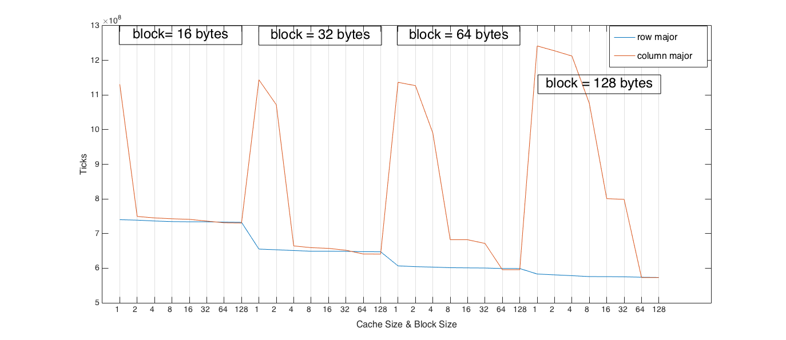
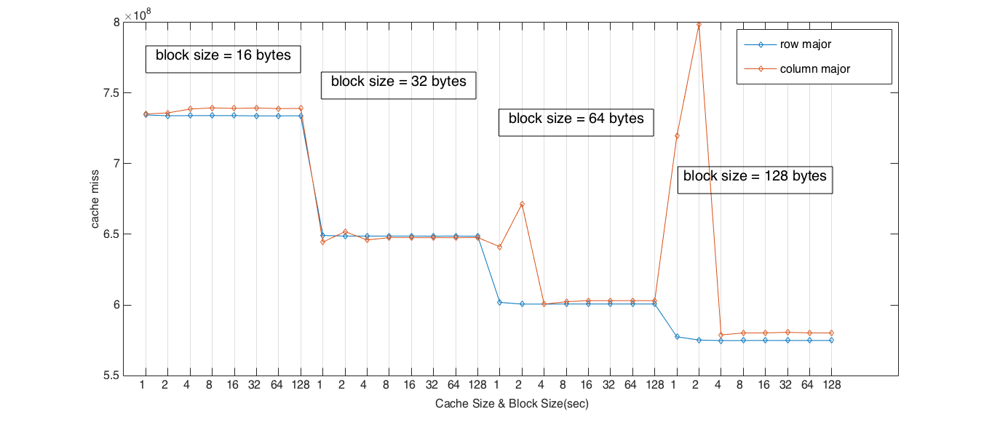
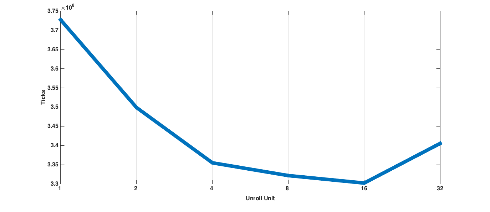
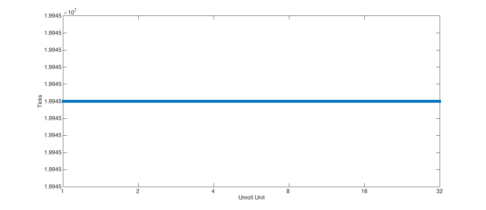

# <center> Advacned Computer Architectire </center>
### <center> [HW3] 102062111 林致民 </center>

## Q1.
(註：(b)題把他融合進(a), (c)答題裡面)
### (a)、(b) 找一個規格，使得兩個program跑起來一樣
我的控制變因是：N = 100, Associative = 2; 操作變因：row/column, block size(bytes), dcache size(kB)。以下是圖表：



1. 其實會發現到，在dcache size = 1kB的時候，當block size越來越大，ticks數也會上升，這個原因推測是增加block size會導致miss penalty的上升。
2. 在相同的block size條件下，cache size增加的時候，ticks也會減少。
3. cache size比較大的時候，block size增加，也會使得ticks減少。
4. 找出藍色和紅色線相會處，就是這一題我們要的答案了:
	
	`cache size = 32kB`  `2 way associative` `block size = 16 bytes` `N = 100`

###  (b)、(c) 改變block size 和 associativity 效能的差異：

 這個實驗固定`N = 100`, `dcache size = 32kB`



1. 當block size比較大的時候，增加associativity會讓ticks數減少，推測原因是這樣可以減少miss時增加的penalty
2. 在每個block size都有個共同現象是，當1 way(direct map)增加成2 way，ticks 數反而會增加，而在block size比較大的時候增加得更加劇烈。
3. 當way associativity比較大的時候，block size增加，ticks數會有減少的趨勢。

## Q2 (a) (b)
以下是loop unroll 和沒有 unroll 的 pseudocode

**一般的Loop的code：**

```cpp
#include <stdio.h>
#define N 100

int main(int argc, char **argv) {
  int a[N], b[N], c[N];
  for (int i = 0; i < N; ++i)
    for (int j = 0; j < N; ++j)
      a[i] = b[i] + c[i];

  return 0;
}
```

**Loop unroll：**

```cpp
#include <stdio.h>
#define N 100

int main(int argc, char **argv) {
  int a[N], b[N], c[N];
  for (int i = 0; i + 5 < N; i += 5)
    for (int j = 0; j < N; j += 5) {
      a[i] = b[i] + c[i];
      a[i+1] = b[i+1] + c[i+1];
      a[i+2] = b[i+2] + c[i+2];
      a[i+3] = b[i+3] + c[i+3];
      a[i+4] = b[i+4] + c[i+4];
    }
  // 這裡處理超出loop範圍的運算
  return 0;
}
```
assembly 的部分，loop body當然多出四個運算的部分，迭代一次加的距離也變大了，比較的部分（ i < N v.s. i +５ < N)也多出一些instructions:

##### Loop :
```cpp
  81                $L2:
  82 00a0 14002FA0      ldl $1,20($15)
  83 00a4 A17D2C40      cmple $1,99,$1
  84 00a8 DEFF3FF4      bne $1,$L5
```

##### Loop unroll
```cpp
 189                $L2:
 190 0240 14002FA0      ldl $1,20($15)
 191 0244 01B02040      addl $1,5,$1
 192 0248 0100E143      addl $31,$1,$1
 193 024c A17D2C40      cmple $1,99,$1
 194 0250 74FF3FF4      bne $1,$L5
```

##### 以下是對loop unroll，沒有套用optimization的結果：


如果只做unroll，沒有做其他optimization的話，超過unroll unit 16，會開始上升。從圖表看來，在Unroll Unit = 16的時候，大概是最好的結果了。

對這兩個program做 `-O2` 之後，發現兩個program的loop直接消失了，目前猜測是因為某些變數用不到，經過control flow analysis，直接被當作dead code消滅掉了。以下是跑出來的結果：

