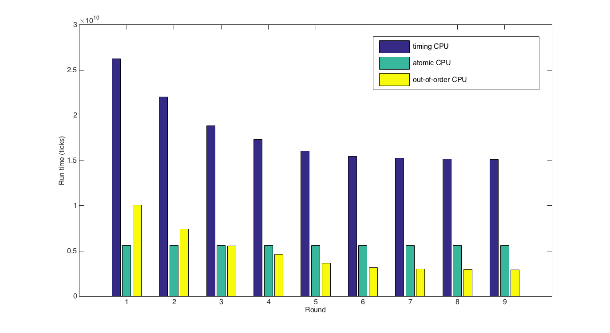
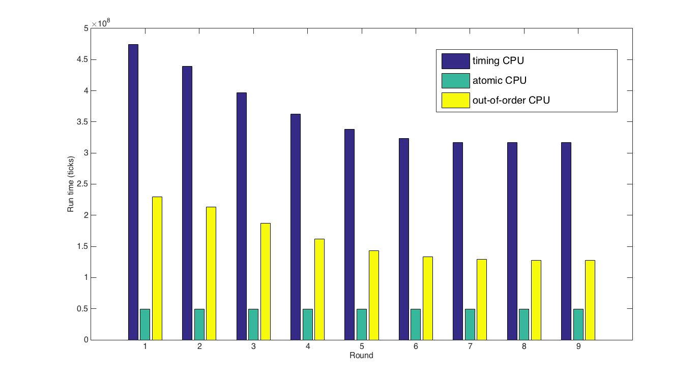
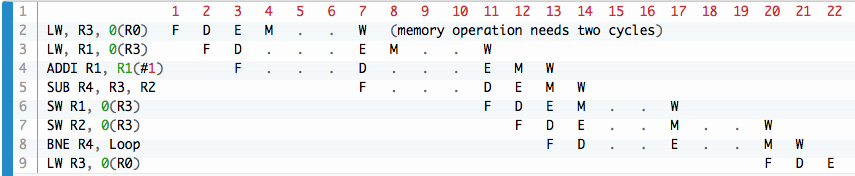

# <center> [HW4] Advanced Computer Architecture </center>
### <center> 102062111 林致民　</center>

## Three CPU Comparison

實驗規格：

```bash
CPU : timing, atomic, out-of-order
Benchmark : gcc, perlbench
L1 DCache Size : 2 4 8 16 32 64 128 256 512 
L1 ICache Size : 1 2 4  8 16 32  64 128 256
L2 Cache size : 2MB
L2 Cache set : 2
```

以下是針對以上規格所跑出來的結果：
### <center> GCC </center>


### <center> PerlBench </center>


可以觀察到一個現象，atomic CPU不會因為L1 cache size改變而有所變化。目前推測的原因是每一次wrtie to memory 的 atomic operation都會寫回Memory，讀取的時候也都會從Memory讀進來，並不會因為cache裡面有資料，就直接從裡面讀，還是要到Memory把資料撈到register，或者把資料寫回Memory，以確保資料的正確性，所以cache size跟ticks 的變化沒有太大的關係。

使用GCC Benchmark跑出來的結果，Atomic 在 cache size比較小的時候ticks比較少，相對於其他的CPU比較快，但是當`L1 Dcache = 8, L1 Icache = 4`的時候，Out-of-order會比 atomic快。L1 Cache size 增加對timing CPU來說會有較大的效能增長。

但是使用Perlbench Benchmark 跑出來的結果卻是從頭到尾都是atomic-CPU最快，甚至還比O3CPU還快。目前推測主要的原因是perlbench對O3CPU不是很友善，O3CPU可以predict branch，但是如果猜錯太多次，會造成整體效能降低。

## Exercise 3.11 

### Instruction 

```cpp
Loop:   LW      R3, 0(R0) 
        LW      R1, 0(R3)
        ADDI    R1, R1(#1) 
        SUB     R4, R3, R2 
        SW      R1, 0(R3) 
        SW      R2, 0(R3) 
        BNZ     R4, Loop
```

### Run Result 
Use `.` symbol to show `stall`; and then `F, D, E, M, W` means `fetch, decode, execute, memory operation, write back`:



#### (a)
上圖`line 9`原本要在`cycle = 14`的時候就要Fetch，但是由於`line 7 的 R3`還沒有到W這個Stage，要Write Back完才可以繼續執行Branch Instruction。所以拖到`cycle = 20`的時候才繼續執行下一次Loop:的LW，因此 $Answer : 20-14 = 6\ Cycles\ Overhead$

#### (b)
如果要知道「我要跳到前面的address，還是後面的address」，我們還是必須把Branch Instruction fetch & decode，decode完之後才可以知道到底要跳到`正方向`還是`負方向`，因此還是需要2個cycles才可以知道。$Answer :\ 2\ Cycles\ Overhead$

#### (c)
Dynamic branch predictor 會把之前fetch 的branch instruction 記錄下來，然後看之前的狀態到底是什麼，假設猜對那就直接往下繼續做，這時候理所當然 ***不會有overhead***。如果猜錯再把她們清掉，fetch新的instruction。

## Exercise class example

| Instruction | Issue | Execute/Memory $(START \to STOP)$ | Write result | Comment |
|:---:|:---:|:---:|:----:|:----:|
| LD F3, 0(R0)      | 1 | 2 ~ 3  | 8 | Write to F3 |
|LD F1, 0(R3)       | 2 | 3 ~ 4  | 5 | Write to F1 |
| ADDD F1, F1, F1   | 3 | 5 ~ 7  | 8 | Wait for F1 |
| ADDD F3, F1, F3   | 4 | 8 ~ 10 | 11| Wait for F1 |
| MULTD F4, F1, F2  | 5 | 8 ~ 18 | 19| Wait for F1 |
|SUBD F4, F3, F2    | 6 | 11 ~ 13| 14| Wait for f3 |   
| DIVD F1, F3, F3   | 7 | 11 ~ 51| 52| Wait for F3 |


