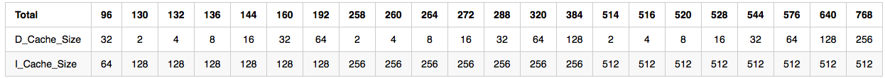
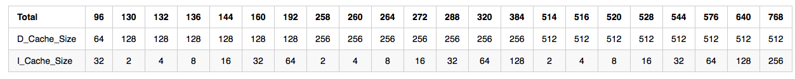

# <center>Advanced Computer Architecture</center>
### <center> [HW1] 102062111 林致民</center>


## Determination

針對不同的I Cache、D Cache size，使用Simulator & Benchmark觀察模擬出來的效能數據

## Preparation

### Input

1. Input testcase 根據作業的spec，D_Cache_size和C_Cache_Size都要是2的次方

2. $Total\_Cache\_size = D\_Cache\_size + I\_cache\_size$ 加起來可以不用是2的次方

3. Total_Cache_size 必須可以被拆成兩個Machine

	e.g. Total_Cache_Size = 96kB :

	`Machine A = [D_Cache_Size = 32kB, I_Cache_Size = 64kB]`
	`Machine B = [D_Cache_Size = 64kB, D_Cache_Size = 32kB]`
	
4. Baseline Computer：$D\_Cache\_size=64kB$、$I\_cache\_size=32kB$

### Input testcase Observation


* 由Input的計算方式可以猜測，Machine 是採用 Harvard Architecture（如圖，by wikipedia）


* 因為$Total\_Cache\_size = D\_Cache\_size + I\_cache\_size$ ，所以 D Cache & I Cache 分別放在不同的地方，而不是在同一個區塊上

* 要知道可以放哪些Input，這些Input可以用以下簡單的ruby code去檢測

	```ruby
	  def powOf2(x) #check if x is power of 2
	    if x == 1
	      return false
	    end
	    while x > 1
	      if (x % 2) == 1
	        return false
	      end
	      x = x / 2;
	    end
	    return true
	  end
	  
	  def check(x, y)  # check x & y are both power of 2
	   return powOf2(x) && powOf2(y)
	  end
	```
* 用暴力的方法去檢測Total_cache_size = 96kB ~ 1024kB中，只有22組是合法的測資，分別是

	```
	96    130   132   136   144   160   
	192   258   260   264   272   288   
	320   384   514   516   520   528   
	544   576   640   768
	```
	這些組合，「最多」只能拆成 ***兩個*** machine
	
## Run Benchmark

### Testase Table

**Machine A :**

* Table

* Curve


**Machine B :**



	
	

### Benchmark Choice

首先，可以先把22組測試資料通通跑過一次，觀察每個benchmark根據不同的machine profile跑出來的趨勢判斷到底哪些benchmark是比較有代表性的，下圖是我跑出來的結果：

### Easy compare


