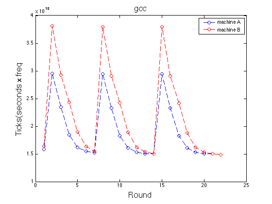
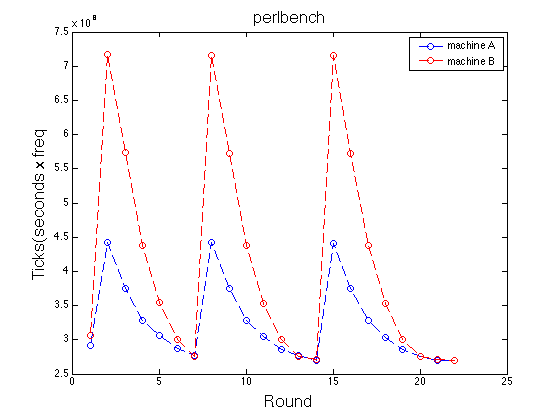
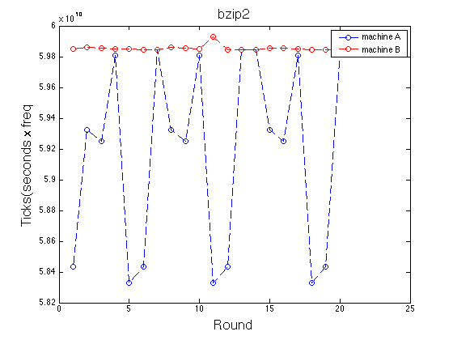
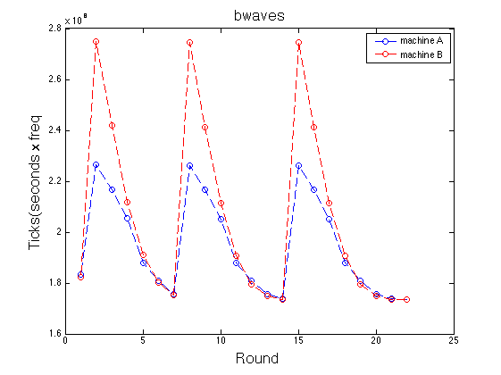
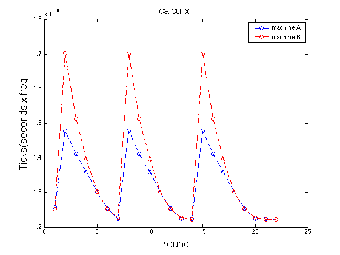
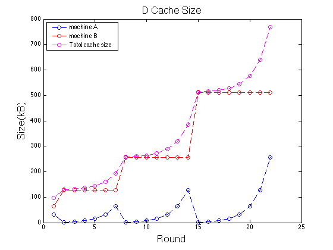
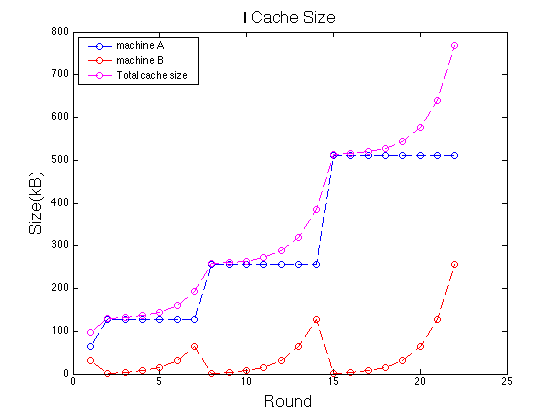

# <center>Advanced Computer Architecture</center>
### <center> [HW1] 102062111 林致民</center>


## Determination

針對不同的I Cache、D Cache size，使用Simulator & Benchmark觀察模擬出來的效能數據

## Preparation

### Input

1. Input testcase 根據作業的spec，D_Cache_size和C_Cache_Size都要是2的次方

2. $Total\_Cache\_size = D\_Cache\_size + I\_cache\_size$ 加起來可以不用是2的次方

3. Total_Cache_size 必須可以被拆成兩個Machine

	e.g. Total_Cache_Size = 96kB :

	`Machine A = [D_Cache_Size = 32kB, I_Cache_Size = 64kB]`
	`Machine B = [D_Cache_Size = 64kB, D_Cache_Size = 32kB]`
	
4. Baseline Computer：$D\_Cache\_size=64kB$、$I\_cache\_size=32kB$

### Input testcase Observation


* 由Input的計算方式可以猜測，Machine 是採用 Harvard Architecture（如圖，by wikipedia）


* 因為$Total\_Cache\_size = D\_Cache\_size + I\_cache\_size$ ，所以 D Cache & I Cache 分別放在不同的地方，而不是在同一個區塊上

* 要知道可以放哪些Input，這些Input可以用以下簡單的ruby code去檢測

	```ruby
	  def powOf2(x) #check if x is power of 2
	    if x == 1
	      return false
	    end
	    while x > 1
	      if (x % 2) == 1
	        return false
	      end
	      x = x / 2;
	    end
	    return true
	  end
	  
	  def check(x, y)  # check x & y are both power of 2
	   return powOf2(x) && powOf2(y)
	  end
	```
* 用暴力的方法去檢測Total_cache_size = 96kB ~ 1024kB中，只有22組是合法的測資，分別是

	```
	96    130   132   136   144   160   
	192   258   260   264   272   288   
	320   384   514   516   520   528   
	544   576   640   768
	```
	這些組合，「最多」只能拆成 ***兩個*** machine
	
## Run Benchmark

### Testase Table

Testcase的設計偏向Machine A 的 D cache size 永遠小於 I Cache size，Machine B 則是Machine A 的相反

**Machine A**


**Machine B :**


### Benchmark Choice

首先，可以先把22組測試資料通通跑過一次，觀察每個benchmark根據不同的machine profile跑出來的趨勢判斷到底哪些benchmark是比較有代表性的，下圖是我跑出來的結果：

**Benchmark比較圖：**

|					  |                 |
| ----------------  | ------------------ |
|  |  |
| |  |
|  |  | 

稍微觀察一下，會發現bzip2畫出來的形狀跟其他的benchmark差很多。Machine B很平穩，Machine A非常劇烈的跳動，初步猜測跟 D Cache Size有關，D Cache size 與 I Cache Size 越接近，他的ticks數越大，如果比較 D cache 的變化和bzip2 ticks的變化，會發現他們之間有些為的相關性，如下圖：

|					  |                    |
| ----------------  | ------------------ |
|  |  |


### Comparasion

我從五種benchmark中挑出三種benchmark跑出來的結果：GCC, PerlBench, bzip2，並且挑選$Totcal\_cache\_size=130kB$的Machine A,B 與Baseline做比較 

* 測量得到的結果

	| Machine  | DCache(kB) | ICache(kB) | GCC(Ticks)           | PerlBench(ticks) | bzip2(ticks)        |
	| -------: | :---------: | :---------: | :-----------------:  | :--------------: | :---------:         | 
	| Baseline | 64          | 32          |  16401167000(1)      |     306285000(1) | 59848220000(1)      |
	| MachineA| 2           | 128         |  29552917000(1.8019) |442313000(1.4441) | 59323032000(0.9912) |
	| MachineB| 128         | 2           |  38108051000(2.3235) |716877000(2.3406) | 59858215000(1.0002) |

* 平均三個benchmark所得到的結果，Ratio 則是以normalize 到 baseline machine為主 
	
	| Machine  |    Arithmetic mean    | Arithmetic mean of ratios |        Geometry mean  |
	| -------: | :-------------------: | :-----------------------: | :-------------------: | 
	| Baseline | $2.5519\times10^{10}$ | 1                         |  $6.6991\times10^{9}$ | 
	| Machine A| $2.9773\times10^{10}$ | 1.4124                    |  $9.1872\times10^{9}$ | 
	| Machine B| $3.2894\times10^{10}$ | 1.8881                    |  $11.781\times10^{9}$ | 
	
Ticks 越小，顯示出來的效能越好。使用這三者來比較，均會發現Baseline的Machine 是最好的，而Machine B的DCache雖然比Machine A的DCache還大，但是效能並沒有比較好，或許 ICache 影響效能的程度比DCache還來的高。

### Analysis

將22組測試資料丟進simulator，並且把五種benchmark跑過一遍，把資料彙整並畫出圖表。前面的 **Testase Table** 會在這裡以圖鳥的形式呈現。

|   DCache Size        |         ICahce Size  |
| :------------------: | :------------------: |
|  |  |


